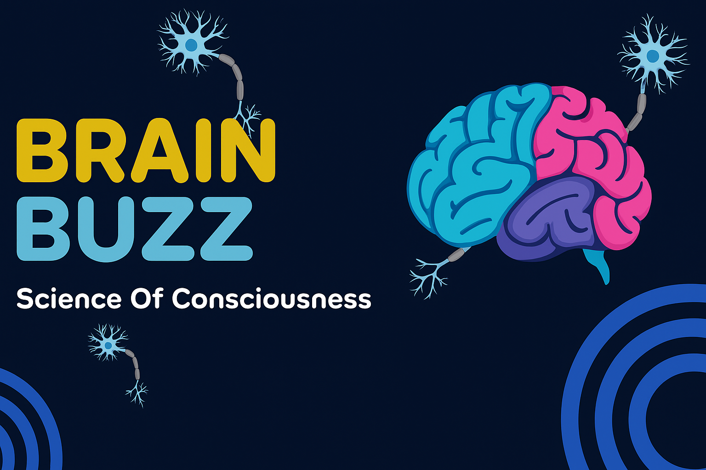
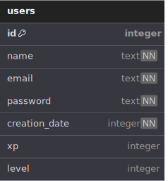
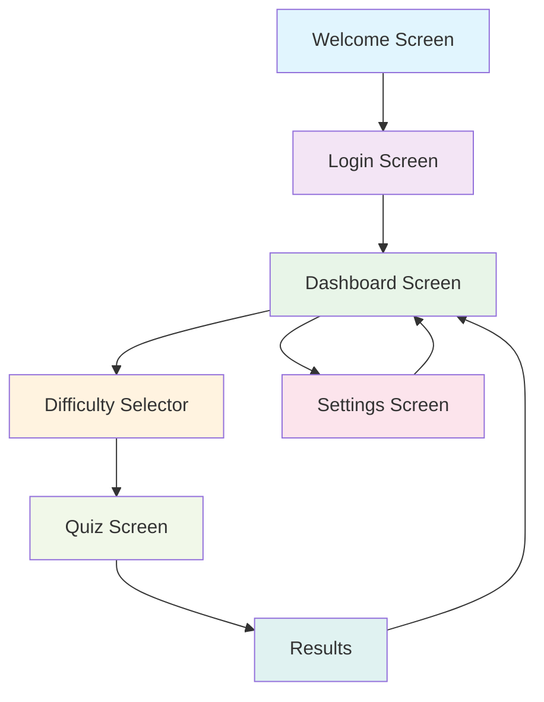

<div align="center"> 
  

[](LICENSE)
<br><br>


**BrainBuzz** - educational quiz mobile application with advanced leveling system and gamification 🚀

</div>

---

## Table of Contents

1. [Application Description](#application-description)
2. [Database](#database)
3. [Navigation Schema](#navigation-schema)
4. [Installation and Setup](#installation-and-setup)
5. [Features](#features)

---

## Application Description

**BrainBuzz** is a modern mobile application for the Android system, designed for learning through interactive quizzes. The application combines education with gamification, offering users an engaging learning experience across various knowledge categories.

### Key Features:

- **Leveling and XP System**: User progression with dynamic experience system
- **Diverse Categories**: Mathematics, Science, History, Geography, and many others
- **Three Difficulty Levels**: Easy, Medium, Hard with different XP rewards
- **Advanced Animations**: Smooth transitions and visual effects
- **Sound System**: Background music and sound effects

### Technologies:

- **Frontend**: React Native 0.72.0 with TypeScript
- **Backend**: Kotlin with Android Native Modules
- **Database**: Room Database (SQLite)
- **External APIs**: Open Trivia Database
- **Animations**: Lottie React Native
- **Audio**: React Native Sound

---

## Database

The application utilizes **Room Database**, an abstraction layer over **SQLite**, to manage local storage efficiently and with compile-time verification. The database is responsible for securely storing user-related data offline and ensuring persistence across sessions.

### ERD Diagram:



---

## Navigation Schema

### Application Flow Diagram:



### Detailed Screen Descriptions:

#### 1. **Welcome Screen** (`WelcomeScreen`)

- **Purpose**: Splash screen with animation
- **Elements**: Logo, lightning animation, "Enter" button
- **Navigation**: → Login Screen

#### 2. **Login Screen** (`LoginScreen`)

- **Purpose**: User login and registration
- **Elements**: Login/registration forms, validation
- **Navigation**: → Dashboard Screen

#### 3. **Dashboard Screen** (`DashboardScreen`)

- **Purpose**: Main screen with quiz categories
- **Elements**: User header, category grid, XP bar
- **Navigation**: → Difficulty Selector, Settings Screen

#### 4. **Difficulty Selector** (`DifficultySelectorScreen`)

- **Purpose**: Quiz difficulty level selection
- **Elements**: Difficulty buttons (Easy/Medium/Hard), XP information
- **Navigation**: → Quiz Screen, ← Dashboard

#### 5. **Quiz Screen** (`QuizScreen`)

- **Purpose**: Quiz solving interface
- **Elements**: Questions, answers, timer, progress
- **Navigation**: → Results, back option

#### 6. **Settings Screen** (`SettingsScreen`)

- **Purpose**: User settings and account management
- **Elements**: Profile, sound settings, level progress
- **Navigation**: ← Dashboard

### Navigation Types:

- **Stack Navigation**: Main navigation between screens
- **Modal Navigation**: Settings Screen as overlay
- **Reset Navigation**: Return to Login after logout

---

## Installation and Setup

### Requirements:

- Node.js 16+
- React Native CLI
- Android Studio
- JDK 11+

### Installation Steps:

1. **Clone Repository**

```bash
git clone https://github.com/xShadyy/BrainBuzz
cd BrainBuzz
```

2. **Install Dependencies**

```bash
npm install
```

3. **Run on Android**

```bash
npm run start
npm run android
```

---

## Features

### Core Functions:

- **User registration and login**
- **Quiz system with various categories**
- **Three difficulty levels with different XP rewards**
- **Leveling and progression system**
- **Instant feedback**

### Advanced Features:

- **Lottie animations for better UX**
- **Sound system with background music**
- **Dynamic visual effects**
- **Responsive design**
- **Gesture and transition handling**

### Gamification:

- **XP points for correct answers**
- **8 progression levels**
- **Visual progress indicators**
- **Reward and achievement effects**

---
