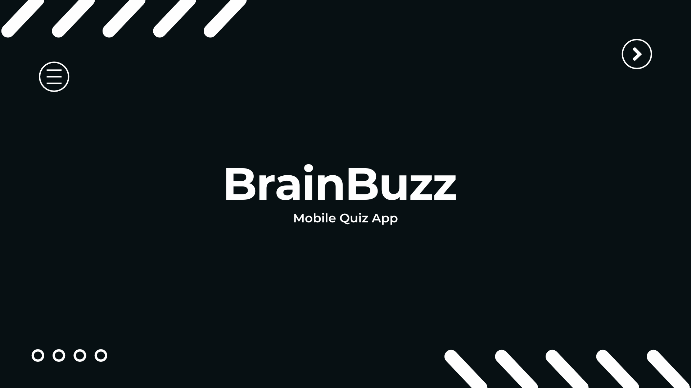

 

 
  

  

Dive into **BrainBuzz**, the quiz-driven mobile app that supercharges your learning 🚀  
Challenge yourself and discover a world of insight

---

## Features

- **Real-Time Feedback**  
  Instant explanations and score breakdowns after each quiz.

- **Flexible Study Modes**  
  Choose between 3 different difficulties and gain more XP.

- **Various Categories**  
  From Math and Science to Space and Health.

- **Progress Dashboard**  
  Visualize your leveling progress with dynamic XP bar.

---

## Preview

  
  
  

---
